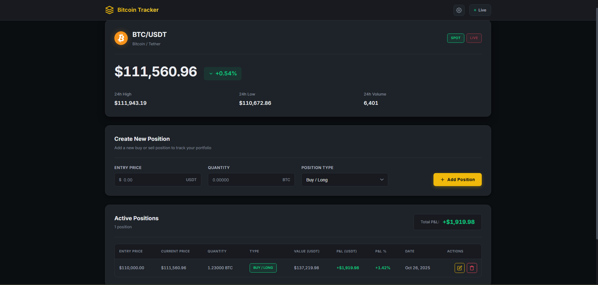
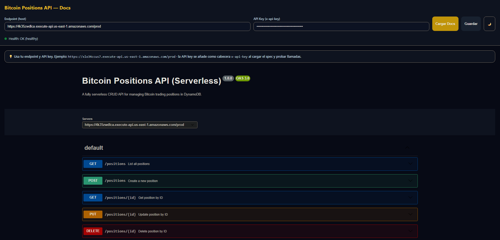

# 🚀 Bitcoin Positions Tracker

> **Production-grade cryptocurrency portfolio manager built with AWS cloud-native services**

[](https://aws.amazon.com/)
[](https://nodejs.org/)
[](https://aws.amazon.com/dynamodb/)
[](LICENSE)

A full-stack Bitcoin trading positions tracker featuring **two complete architectural implementations**: containerized (ECS Fargate) and serverless (Lambda), showcasing modern cloud design patterns and infrastructure-as-code best practices.

---

## 🎯 **Key Highlights**

- 🏗️ **Dual Architecture**: ECS Fargate + Serverless Lambda implementations
- 📊 **Real-time P&L Calculation**: Live Bitcoin prices via Binance WebSocket
- 📖 **Auto-generated API Docs**: OpenAPI/Swagger specification included
- 🔐 **Secure by Design**: API Gateway with API Key authentication
- 🚢 **100% IaC**: Complete CloudFormation deployment templates
- 💰 **Cost-optimized**: Detailed pricing analysis (76% savings with serverless)
- 🎨 **Modern Frontend**: Professional dashboard with real-time updates

---

## 📸 **Screenshots**

<div align="center">

### Dashboard with Real-time P&L


### Interactive API Documentation


</div>

---

## 🏛️ **Architecture Comparison**

<table>
<tr>
<td width="50%">

### ☁️ **ECS Fargate (Containerized)**

```
Client → API Gateway → VPC Link
         ↓
    Network Load Balancer
         ↓
    ECS Fargate (Express.js)
         ↓
      DynamoDB
```

**Components:**
- Express.js REST API
- Docker containerization
- Private NLB + VPC Link
- CloudWatch monitoring

**Cost:** $57/month

</td>
<td width="50%">

### ⚡ **Lambda (Serverless)**

```
Client → API Gateway → Lambda
                         ↓
                     DynamoDB
```

**Components:**
- 5 independent functions
- Event-driven execution
- Auto-scaling built-in
- Pay-per-invocation

**Cost:** $7.53/month
**💰 87% cheaper**

</td>
</tr>
</table>

---

## 🛠️ **Tech Stack**

### **Backend**
- **ECS Version:** Node.js 18, Express, Swagger-jsdoc, AWS SDK v2
- **Lambda Version:** Node.js 18, AWS SDK v3, DynamoDB Client

### **Infrastructure**
- **Compute:** ECS Fargate / AWS Lambda
- **Database:** DynamoDB (On-Demand)
- **API:** API Gateway (REST)
- **Storage:** S3 (Static hosting), ECR (Container registry)
- **IaC:** CloudFormation (YAML templates)
- **Networking:** VPC Link, Network Load Balancer

### **Frontend**
- Vanilla JavaScript (WebSocket integration)
- Real-time Binance API connection
- Responsive design with CSS Grid
- LocalStorage for configuration persistence

---

## 🚀 **Quick Start**

### **Prerequisites**
```bash
# Install AWS CLI
curl "https://awscli.amazonaws.com/awscli-exe-linux-x86_64.zip" -o "awscliv2.zip"
unzip awscliv2.zip && sudo ./aws/install

# Configure credentials
aws configure
```

### **Deploy Lambda (Serverless) - Recommended**

```bash
cd backend/lambda

# 1. Package Lambda functions
cd lambdas && npm install --omit=dev && cd ..
Compress-Archive -Path lambdas/* -DestinationPath lambda-code.zip -Force

# 2. Create S3 bucket and upload code
aws s3 mb s3://bitcoin-lambda-deploy
aws s3 cp lambda-code.zip s3://bitcoin-lambda-deploy/

# 3. Deploy CloudFormation stack
aws cloudformation deploy \
  --template-file deploy.yml \
  --stack-name bitcoin-tracker-lambda \
  --parameter-overrides LambdaCodeBucket=bitcoin-lambda-deploy \
  --capabilities CAPABILITY_NAMED_IAM

# 4. Get API URL and Key
aws cloudformation describe-stacks \
  --stack-name bitcoin-tracker-lambda \
  --query "Stacks[0].Outputs"
```

### **Deploy ECS (Containerized)**

```bash
cd backend/ecs

# 1. Build and push Docker image
make build
make push

# 2. Deploy infrastructure
aws cloudformation deploy \
  --template-file deploy.yml \
  --stack-name bitcoin-tracker-ecs \
  --parameter-overrides \
      ECRImage=<YOUR_ECR_IMAGE_URI> \
      VpcId=<YOUR_VPC_ID> \
      SubnetIds=<SUBNET_1>,<SUBNET_2> \
  --capabilities CAPABILITY_NAMED_IAM
```

### **Deploy Frontend**

```bash
cd frontend

# 1. Create S3 bucket
aws s3 mb s3://bitcoin-positions-ui --region us-east-1

# 2. Enable static website hosting
aws s3 website s3://bitcoin-positions-ui/ \
  --index-document index.html

# 3. Apply public read policy
aws s3api put-bucket-policy \
  --bucket bitcoin-positions-ui \
  --policy file://policy.json

# 4. Upload files
aws s3 sync . s3://bitcoin-positions-ui

# 5. Access your site
echo "http://bitcoin-positions-ui.s3-website-us-east-1.amazonaws.com"
```

---

## 📡 **API Endpoints**

### **Public Endpoints**
| Method | Endpoint | Description |
|--------|----------|-------------|
| `GET` | `/` | API information |
| `GET` | `/health` | Health check |
| `GET` | `/openapi.json` | Swagger specification |

### **Protected Endpoints** (Require `x-api-key` header)
| Method | Endpoint | Description |
|--------|----------|-------------|
| `POST` | `/positions` | Create new position |
| `GET` | `/positions` | List all positions |
| `GET` | `/positions/{id}` | Get position by ID |
| `PUT` | `/positions/{id}` | Update position |
| `DELETE` | `/positions/{id}` | Delete position |

### **Example Request**
```bash
# Create position
curl -X POST https://YOUR_API_URL/prod/positions \
  -H "x-api-key: YOUR_API_KEY" \
  -H "Content-Type: application/json" \
  -d '{
    "symbol": "BTCUSDT",
    "quantity": 0.5,
    "type": "buy",
    "entry": 68000.50,
    "date": "2025-10-26T00:00:00Z"
  }'
```

---

## 🧪 **Testing**

Use the provided `tests.http` file with VS Code REST Client extension:

```http
### Create Position
POST {{host}}/positions
Content-Type: application/json
x-api-key: {{apiKey}}

{
  "symbol": "BTCUSDT",
  "quantity": 0.25,
  "type": "buy",
  "entry": 68000.50,
  "date": "2025-10-26T00:00:00Z"
}

### Get All Positions
GET {{host}}/positions
x-api-key: {{apiKey}}

### Delete Position
DELETE {{host}}/positions/{{positionId}}
x-api-key: {{apiKey}}
```

---

## 📂 **Project Structure**

```
.
├── backend/
│   ├── ecs/
│   │   ├── app.js              # Express REST API
│   │   ├── Dockerfile          # Container definition
│   │   ├── deploy.yml          # CloudFormation (750+ lines)
│   │   ├── Makefile           # Build automation
│   │   └── package.json
│   ├── lambda/
│   │   ├── lambdas/
│   │   │   ├── crud.js         # Create/Update/Delete
│   │   │   ├── read.js         # Read operations
│   │   │   ├── openapi.js      # Swagger spec
│   │   │   ├── health.js       # Health check
│   │   │   └── root.js         # Root handler
│   │   ├── deploy.yml          # CloudFormation (550+ lines)
│   │   └── deploy.ps1          # Deployment script
│   └── tests.http              # REST Client tests
├── frontend/
│   ├── index.html              # Main dashboard
│   ├── api-docs.html           # Swagger UI viewer
│   ├── scripts.js              # Business logic + WebSocket
│   ├── styles.css              # Modern responsive design
│   └── policy.json             # S3 bucket policy
└── README.md
```

---

## 🎓 **Learning Outcomes**

This project demonstrates proficiency in:

### **Cloud Architecture**
- ✅ Designing highly available, scalable systems
- ✅ Implementing microservices vs monolithic patterns
- ✅ Cost optimization strategies for cloud workloads
- ✅ Security best practices (API Keys, IAM roles, VPC isolation)

### **DevOps & IaC**
- ✅ Infrastructure as Code with CloudFormation
- ✅ CI/CD automation with Makefiles and scripts
- ✅ Docker containerization and ECR management
- ✅ Monitoring and logging with CloudWatch

### **Backend Development**
- ✅ RESTful API design following OpenAPI standards
- ✅ NoSQL database modeling with DynamoDB
- ✅ Event-driven serverless architectures
- ✅ WebSocket integration for real-time data

---

## 🤝 **Contributing**

Contributions are welcome! Here are some ideas:

- 🔹 Add authentication with AWS Cognito
- 🔹 Implement caching layer with ElastiCache
- 🔹 Add CI/CD pipeline with GitHub Actions
- 🔹 Create Terraform alternative to CloudFormation
- 🔹 Add monitoring dashboard with Grafana
- 🔹 Implement WebSocket API for real-time updates

---

## 📄 **License**

This project is licensed under the MIT License - see the [LICENSE](LICENSE) file for details.

---

## 👨‍💻 **Author**

**Sergio Acosta Quintana**

- 🎓 Computer Engineering Student @ ULPGC
- 🌐 Cloud Computing Enthusiast
- 📫 [LinkedIn](https://linkedin.com/in/sergioacostaquintana) | [GitHub](https://github.com/SergioAcostaTer)

---

## 🙏 **Acknowledgments**

- Built as part of the Cloud Computing course at Universidad de Las Palmas de Gran Canaria
- Bitcoin price data provided by [Binance WebSocket API](https://binance-docs.github.io/apidocs/spot/en/)
- Inspired by modern fintech applications and cloud-native best practices

---

<div align="center">

### ⭐ **If you found this project helpful, please give it a star!**

**Made with ☕ and ☁️ by Sergio Acosta Quintana**

</div>